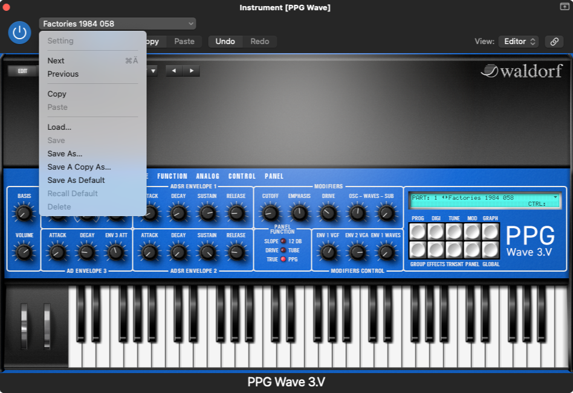
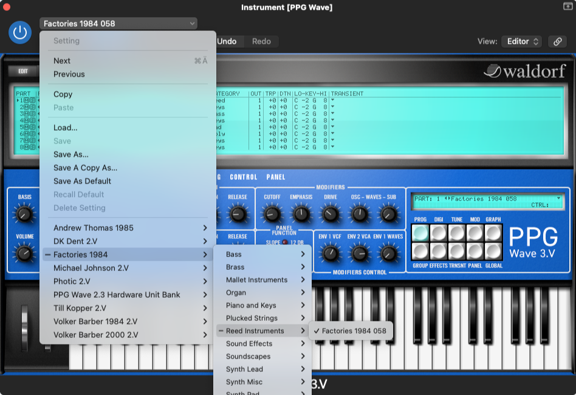
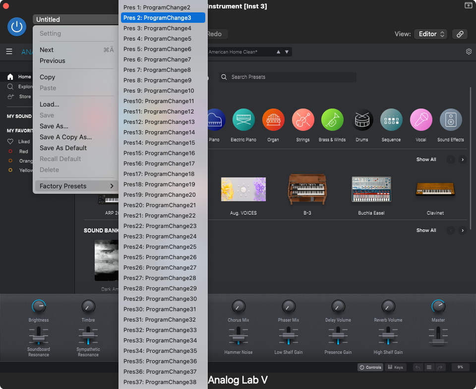
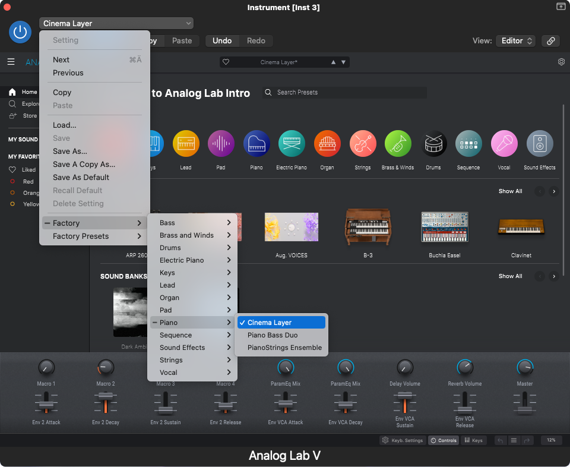

# Audio Unit Preset Generator

This script create .aupreset files for Audio Unit instruments from the factory preset database.
It currently supports the following instruments:

* Waldorf PPG Wave 3.V
* Arturia Analog Lab, V Collection instruments, Pigments

It is easily extended to other plugins (pull requests are welcome) as long as the presets are available in NKS format or an SQLite database.

## Usage

```bash
git clone https://github.com/mkuron/aupreset-generator.git
cd aupreset-generator
python3 -m pip install -r requirements.txt
python3 -m aupreset_generator
```

## Screenshots

### Waldorf PPG Wave 3.V

#### before



#### after



### Arturia Analog Lab 5

#### before



#### after


